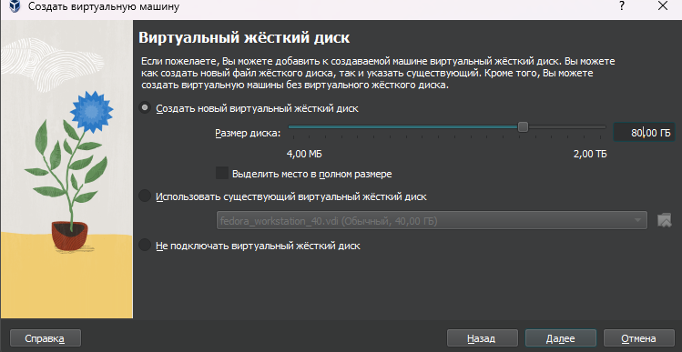
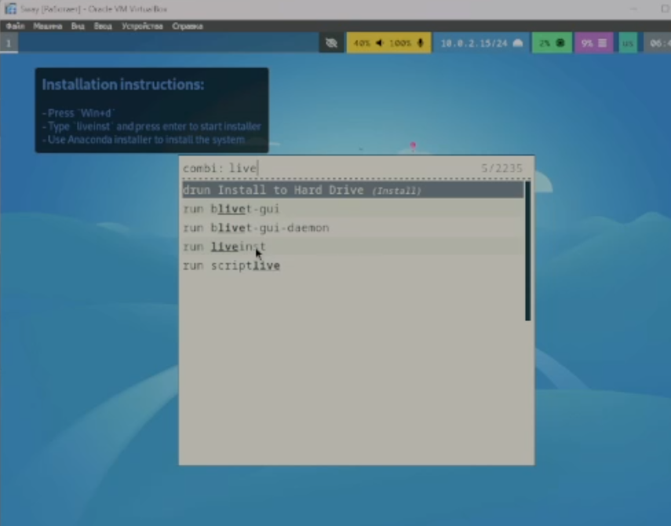
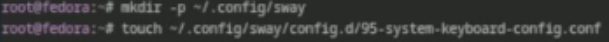

---
## Front matter
title: "Установка и конфигурация операционной системы на виртуальную машину"
subtitle: "Лабораторная работа №1"
author: "Казначеев Сергей Ильич"

## Generic otions
lang: ru-RU
toc-title: "Содержание"

## Bibliography
bibliography: bib/cite.bib
csl: pandoc/csl/gost-r-7-0-5-2008-numeric.csl

## Pdf output format
toc: true # Table of contents
toc-depth: 2
lof: true # List of figures
lot: true # List of tables
fontsize: 12pt
linestretch: 1.5
papersize: a4
documentclass: scrreprt
## I18n polyglossia
polyglossia-lang:
  name: russian
  options:
	- spelling=modern
	- babelshorthands=true
polyglossia-otherlangs:
  name: english
## I18n babel
babel-lang: russian
babel-otherlangs: english
## Fonts
mainfont: IBM Plex Serif
romanfont: IBM Plex Serif
sansfont: IBM Plex Sans
monofont: IBM Plex Mono
mathfont: STIX Two Math
mainfontoptions: Ligatures=Common,Ligatures=TeX,Scale=0.94
romanfontoptions: Ligatures=Common,Ligatures=TeX,Scale=0.94
sansfontoptions: Ligatures=Common,Ligatures=TeX,Scale=MatchLowercase,Scale=0.94
monofontoptions: Scale=MatchLowercase,Scale=0.94,FakeStretch=0.9
mathfontoptions:
## Biblatex
biblatex: true
biblio-style: "gost-numeric"
biblatexoptions:
  - parentracker=true
  - backend=biber
  - hyperref=auto
  - language=auto
  - autolang=other*
  - citestyle=gost-numeric
## Pandoc-crossref LaTeX customization
figureTitle: "Рис."
tableTitle: "Таблица"
listingTitle: "Листинг"
lofTitle: "Список иллюстраций"
lotTitle: "Список таблиц"
lolTitle: "Листинги"
## Misc options
indent: true
header-includes:
  - \usepackage{indentfirst}
  - \usepackage{float} # keep figures where there are in the text
  - \floatplacement{figure}{H} # keep figures where there are in the text
---
# Цель работы

Здесь приводится формулировка цели лабораторной работы. Формулировки
цели для каждой лабораторной работы приведены в методических
указаниях.

Цель данного шаблона --- максимально упростить подготовку отчётов по
лабораторным работам.  Модифицируя данный шаблон, студенты смогут без
труда подготовить отчёт по лабораторным работам, а также познакомиться
с основными возможностями разметки Markdown.

# Задание

Здесь приводится описание задания в соответствии с рекомендациями
методического пособия и выданным вариантом.

# Теоретическое введение

Здесь описываются теоретические аспекты, связанные с выполнением работы.

Например, в табл. [-@tbl:std-dir] приведено краткое описание стандартных каталогов Unix.

: Описание некоторых каталогов файловой системы GNU Linux {#tbl:std-dir}

| Имя каталога | Описание каталога                                                                                                          |
|--------------|----------------------------------------------------------------------------------------------------------------------------|
| `/`          | Корневая директория, содержащая всю файловую                                                                               |
| `/bin `      | Основные системные утилиты, необходимые как в однопользовательском режиме, так и при обычной работе всем пользователям     |
| `/etc`       | Общесистемные конфигурационные файлы и файлы конфигурации установленных программ                                           |
| `/home`      | Содержит домашние директории пользователей, которые, в свою очередь, содержат персональные настройки и данные пользователя |
| `/media`     | Точки монтирования для сменных носителей                                                                                   |
| `/root`      | Домашняя директория пользователя  `root`                                                                                   |
| `/tmp`       | Временные файлы                                                                                                            |
| `/usr`       | Вторичная иерархия для данных пользователя                                                                                 |

Более подробно про Unix см. в [@tanenbaum_book_modern-os_ru; @robbins_book_bash_en; @zarrelli_book_mastering-bash_en; @newham_book_learning-bash_en].

# Выполнение лабораторной работы
Установка Fedora Sway для начала создаем виртуальную машину (рис. [-@fig:001]).

{#fig:001 width=70%}

Далее выделяем память и количество ядер процессора

Выделяем виртуальный диск размером 80гб

После чего включаем 3D ускорение

После установки запускаем виртуальную машину и запустим liveinst

Далее выбираем язык

Указываем диск для установки

Включаем root пользователя и укажем для него пароль

Создаем свою учетную запись 

После чего мы можем изъять загрузочный диск

Переходим в режим супер пользователя 

Далее обновим все пакеты

Далее устанавливаем mc и tmux

Устанавливаем dnf-automatic

Отклучим Selinux

Устанавливаем tmux

Создаем файл

Втавляем код который предложен в лабораторной работе

Теперь поменяем название хоста согласно лабораторной работы 

Устанавливаем pandoc

Скачиваем pandoc-crossref и распаковываем его

Устанавливаем texlive

# Домашнее Задание

Теперь с помощью команды dmesg получим следующую  информацию 

1)Версия ядра Linux 6.12.13
2)Частота процессора 3686
3)Модель процессора (CPU0) Core i5-12600KF
4)Объём доступной оперативной памяти 16
5)Тип обнаруженного гипервизора KVM

Тип файловой системы корневого раздела-BTRFS Последовательность монтирования файловых систем BTRFS(sda3) и EXT4-fs

# Выводы
Я приобрел практические навыки установив операционную систему на виртуальную машину и натроил ее для дальнейшей работы

# Ответы на контрольные вопросы

1)Какую информацию содержит учётная запись пользователя? - Логин пользователя, пароль пользователя, его ID, ID его группы
его дополнительная информация  домашний каталог пользователя 
2)Укажите команды терминала и приведите примеры:
  для получения справки по команде
- Использование
команды man  Например: man cd - узнать что делает команда cd
  для перемещения по файловой системе;
- Использование команды cd Например: cd ~ переместиться в домашний каталог 
  для просмотра содержимого каталога;
- Использование команды ls Например: ls/ посмотерть содежрание каталога 
  для определения объёма каталога;
- Использование команды du Например: du - выводит размер всех файлов каталогов и подкаталогов 
  для создания / удаления каталогов / файлов;
- для создания файлов touch  Например touch /text.txt
- для удаления каталогов rm Например rm / text.txt
- для создания каталогов mkdir Например mkdir /text
- для удаления каталогов rmdir Например rmdir /text
  для задания определённых прав на файл / каталог;
- используется команда chmod  Например chmod +x/text
  для просмотра истории команд.
- используется команда history  Например history
3) Что такое файловая система? Приведите примеры с краткой характеристикой.
- файловая система- это система организации файлов в операционной системе Например 
 FAT - одна из старых файловых систем представленных Microsoft не поддерживала шифрование права пользователей к файлам и  не имела возможности журналирования 
 
 EXT4 - Более современная файловая система которая активно используется в linux поддерживает журналирование,шифрование  и права пользователей к файлам
 
4) Как посмотреть, какие файловые системы подмонтированы в ОС?
 можно посмотреть с помощью команды утилита df
5) Как удалить зависший процесс?
 По PID с помощью команды kill
 
# Список литературы{.unnumbered}

::: {#refs}
:::

