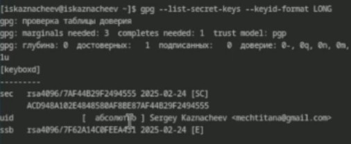

---
## Front matter
title: "Первоначальна настройка git"
subtitle: "Лабораторная работа №2"
author: "Казначеев Сергей Ильич"

## Generic otions	
lang: ru-RU
toc-title: "Содержание"

## Bibliography
bibliography: bib/cite.bib
csl: pandoc/csl/gost-r-7-0-5-2008-numeric.csl

## Pdf output format
toc: true # Table of contents
toc-depth: 2
lof: true # List of figures
lot: true # List of tables
fontsize: 12pt
linestretch: 1.5
papersize: a4
documentclass: scrreprt
## I18n polyglossia
polyglossia-lang:
  name: russian
  options:
	- spelling=modern
	- babelshorthands=true
polyglossia-otherlangs:
  name: english
## I18n babel
babel-lang: russian
babel-otherlangs: english
## Fonts
mainfont: IBM Plex Serif
romanfont: IBM Plex Serif
sansfont: IBM Plex Sans
monofont: IBM Plex Mono
mathfont: STIX Two Math
mainfontoptions: Ligatures=Common,Ligatures=TeX,Scale=0.94
romanfontoptions: Ligatures=Common,Ligatures=TeX,Scale=0.94
sansfontoptions: Ligatures=Common,Ligatures=TeX,Scale=MatchLowercase,Scale=0.94
monofontoptions: Scale=MatchLowercase,Scale=0.94,FakeStretch=0.9
mathfontoptions:
## Biblatex
biblatex: true
biblio-style: "gost-numeric"
biblatexoptions:
  - parentracker=true
  - backend=biber
  - hyperref=auto
  - language=auto
  - autolang=other*
  - citestyle=gost-numeric
## Pandoc-crossref LaTeX customization
figureTitle: "Рис."
tableTitle: "Таблица"
listingTitle: "Листинг"
lofTitle: "Список иллюстраций"
lotTitle: "Список таблиц"
lolTitle: "Листинги"
## Misc options
indent: true
header-includes:
  - \usepackage{indentfirst}
  - \usepackage{float} # keep figures where there are in the text
  - \floatplacement{figure}{H} # keep figures where there are in the text
---
# Цель работы

Изучить идеологию и применение средств контроля версий.
Освоить умения по работе с git.

# Задание

Создать базовую конфигурацию для работы с git.
Создать ключ SSH.Создать ключ PGP.
Настроить подписи git.
Зарегистрироваться на Github.
Создать локальный каталог для выполнения заданий по предмету.

# Теоретическое введение

Здесь описываются теоретические аспекты, связанные с выполнением работы.

Например, в табл. [-@tbl:std-dir] приведено краткое описание стандартных каталогов Unix.

: Описание некоторых каталогов файловой системы GNU Linux {#tbl:std-dir}

| Имя каталога | Описание каталога                                                                                                          |
|--------------|----------------------------------------------------------------------------------------------------------------------------|
| `/`          | Корневая директория, содержащая всю файловую                                                                               |
| `/bin `      | Основные системные утилиты, необходимые как в однопользовательском режиме, так и при обычной работе всем пользователям     |
| `/etc`       | Общесистемные конфигурационные файлы и файлы конфигурации установленных программ                                           |
| `/home`      | Содержит домашние директории пользователей, которые, в свою очередь, содержат персональные настройки и данные пользователя |
| `/media`     | Точки монтирования для сменных носителей                                                                                   |
| `/root`      | Домашняя директория пользователя  `root`                                                                                   |
| `/tmp`       | Временные файлы                                                                                                            |
| `/usr`       | Вторичная иерархия для данных пользователя                                                                                 |

Более подробно про Unix см. в [@tanenbaum_book_modern-os_ru; @robbins_book_bash_en; @zarrelli_book_mastering-bash_en; @newham_book_learning-bash_en].

# Выполнение лабораторной работы 
Для начала установим Git

Теперь установим gh 

Далее задаем имя владельца репозитория

Далее задаем почту владельца git 

Далее настроим котировку UTF-8 в выводе сообщения git 

Зададим имя начальной ветки настроим параметры autocrlf и safecrlf

Создадим ключ RSA размером 4096 бит

Теперь создаем ключ по алгоритму ed22519 

Теперь создаем gpg, выбираем из предложенных вариантов первый тим(тип RSA and RSA),размер 4096 бит  и делаем срок ключа неограниченным

После нас просят ввести свои данные. Мы вводим имя и адрес электронной почты. После этого соглашаемся с генерацией ключа 

Далее выводим список ключей gpg

Копируем наш ключ в буфер обмена

Вставляем ключ на Github и задаем ему имя

Теперь произведем автоматическую настройку подписей

	

После нам нужно авторизироватся в  github с помощью gh. Мы выбираем сайт для авторизации(Github),после выбираем 
предпочитаемый протокол (SSH), публичный ключ SSH ключ (id_rsa.pub) и имя для ключа sway. В качестве способа авторизации выбираем авторизацию через браузер 

Теперь создаем рабочую директорию курса и переходим в неё

Создаем репозиторий для лабораторных работ из шаблона 

И клонируем его к себе на компьютер 

Переходим в него с помощью cd и удаляем файл(package.json) и создаем необходимые каталоги записав в файл COURSE
строку echo os-intro и прописываем make prepare для того, чтобы нужные нам каталоги создались

Теперь добавляем нашу папку для отправки 

Делаем коммит в котором указываем что мы сделали структуру курса
		

И отправляем файлы на Github с помощью команды push 

 

# Выводы

Я изучил идеологию и применение средств контроля версий и освоил умения по работе с git 

# Список литературы{.unnumbered}

::: {#refs}
:::
