---
## Front matter
title: "Индивидуальный проект часть 1"
subtitle: "Отчет"
author: "Казначеев Сергей Ильич"

## Generic otions
lang: ru-RU
toc-title: "Содержание"

## Bibliography
bibliography: bib/cite.bib
csl: pandoc/csl/gost-r-7-0-5-2008-numeric.csl

## Pdf output format
toc: true # Table of contents
toc-depth: 2
lof: true # List of figures
lot: true # List of tables
fontsize: 12pt
linestretch: 1.5
papersize: a4
documentclass: scrreprt
## I18n polyglossia
polyglossia-lang:
  name: russian
  options:
	- spelling=modern
	- babelshorthands=true
polyglossia-otherlangs:
  name: english
## I18n babel
babel-lang: russian
babel-otherlangs: english
## Fonts
mainfont: IBM Plex Serif
romanfont: IBM Plex Serif
sansfont: IBM Plex Sans
monofont: IBM Plex Mono
mathfont: STIX Two Math
mainfontoptions: Ligatures=Common,Ligatures=TeX,Scale=0.94
romanfontoptions: Ligatures=Common,Ligatures=TeX,Scale=0.94
sansfontoptions: Ligatures=Common,Ligatures=TeX,Scale=MatchLowercase,Scale=0.94
monofontoptions: Scale=MatchLowercase,Scale=0.94,FakeStretch=0.9
mathfontoptions:
## Biblatex
biblatex: true
biblio-style: "gost-numeric"
biblatexoptions:
  - parentracker=true
  - backend=biber
  - hyperref=auto
  - language=auto
  - autolang=other*
  - citestyle=gost-numeric
## Pandoc-crossref LaTeX customization
figureTitle: "Рис."
tableTitle: "Таблица"
listingTitle: "Листинг"
lofTitle: "Список иллюстраций"
lotTitle: "Список таблиц"
lolTitle: "Листинги"
## Misc options
indent: true
header-includes:
  - \usepackage{indentfirst}
  - \usepackage{float} # keep figures where there are in the text
  - \floatplacement{figure}{H} # keep figures where there are in the text
---

# Цель работы

Научится создавать сайты с помощью hugo

# Задание

Установить необходимое программное обеспечение.
Скачать шаблон темы сайта.
Разместить его на хостинге git.
Установить параметр для URLs сайта.
Разместить заготовку сайта на Github pages.

# Теоретическое введение

Здесь описываются теоретические аспекты, связанные с выполнением работы.

Например, в табл. [-@tbl:std-dir] приведено краткое описание стандартных каталогов Unix.

: Описание некоторых каталогов файловой системы GNU Linux {#tbl:std-dir}

| Имя каталога | Описание каталога                                                                                                          |
|--------------|----------------------------------------------------------------------------------------------------------------------------|
| `/`          | Корневая директория, содержащая всю файловую                                                                               |
| `/bin `      | Основные системные утилиты, необходимые как в однопользовательском режиме, так и при обычной работе всем пользователям     |
| `/etc`       | Общесистемные конфигурационные файлы и файлы конфигурации установленных программ                                           |
| `/home`      | Содержит домашние директории пользователей, которые, в свою очередь, содержат персональные настройки и данные пользователя |
| `/media`     | Точки монтирования для сменных носителей                                                                                   |
| `/root`      | Домашняя директория пользователя  `root`                                                                                   |
| `/tmp`       | Временные файлы                                                                                                            |
| `/usr`       | Вторичная иерархия для данных пользователя                                                                                 |

Более подробно про Unix см. в [@tanenbaum_book_modern-os_ru; @robbins_book_bash_en; @zarrelli_book_mastering-bash_en; @newham_book_learning-bash_en].

# Выполнение лабораторной работы

Для начала необходимо скачать последнюю версию движка сайтов Hugo для Linux

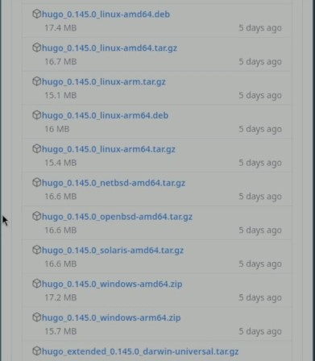

Далее с помощью утилита распаковываем архив с Hugo

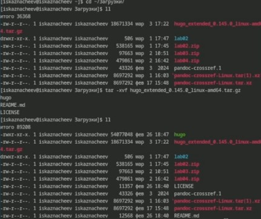

Установим Hugo переместив файл в директорию /usr/local/bin

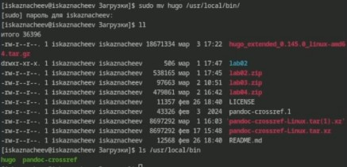

Заходим на страницу шаблона для сайтов и создаем из нее репозиторий 

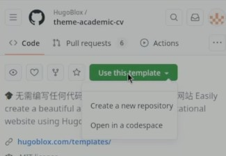

Создаем репозиторий с названием blog

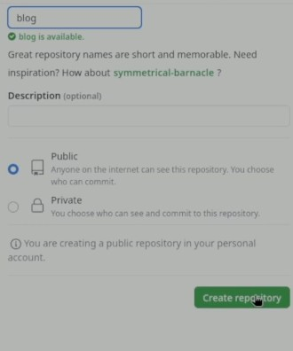

И клонируем репозиторий к себе на компьютер

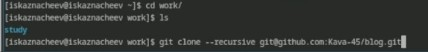

Установим язык Go на компьютер так как он необходим для работы с Hugo

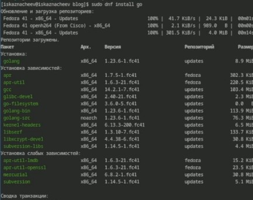

Запустим Hugo В момент запуска он подготовит папку с сайтом создав дополнительные каталоги 

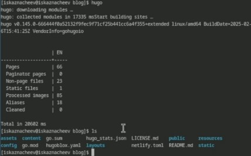

Удаляем папку Public

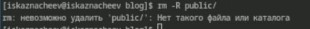

Теперь запустим Hugo с опцией server которая позволит запустить наш сайт 

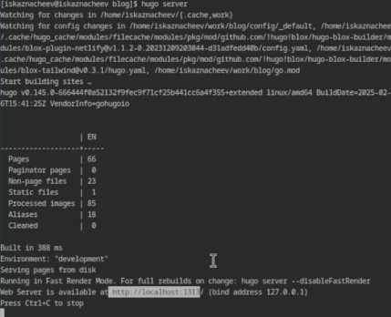

Перейда по адресу local:1313, мы увидим наш сайт 

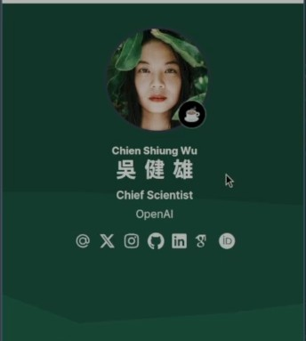

Теперь создаем второй репозиторий на котором будет висеть наш сайт. Его нужно назвать в формате "Имя нашего аккаунат Github + .github.io"

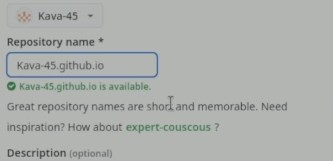

Теперь клонируем наш пустой репозиторий на компьютер создадим README.md и переключимся на ветку main

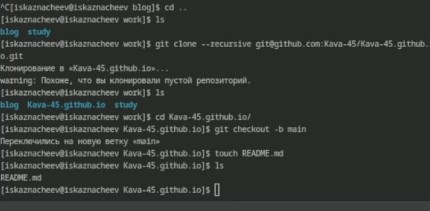

Обновляем репозиторий делаем коммит и отправляем на github

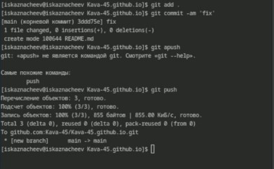

Теперь добавляем второй репозиторий как сабмодуль первого, и он будет хранить в себе папку public

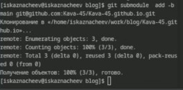

Проверяем корректность настройки сабмодуля 

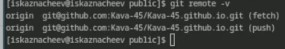

Делаем коммит 

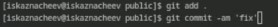

Выгружаем на github

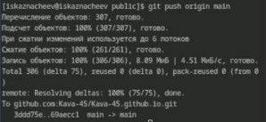

Теперь посмотрим как выглядит наш сайт который располагается https://kava-45.github.io/

# Вывод 

Я научился устанавливать необходимое программное обеспечение,скачивать шаблоны и темы сайтов,размещать их на хостинг git,
устанавливать параметр для URLs сайта, размещать заготовку сайта на Github pages

# Список литературы{.unnumbered}

::: {#refs}
:::
